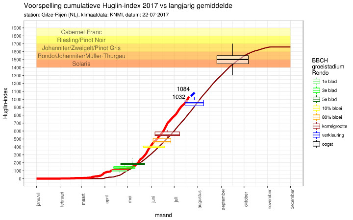

```{r setup, include = FALSE, echo = FALSE}
knitr::opts_chunk$set(echo = TRUE)
```


# Intro

The package KNMIr provides functions to retrieve raw and processed climate
data from the official Dutch meteorological institute (KNMI). For some stations, data goes back to 1900.

The data can be subsetted based on year and specified variables. The returned
data is converted to SI-units, when necessary. 

Several helper functions are available, such as a function that calculates the Huglin- or VE-index.

The package also contains two KNMI datasets with all measurement stations and with long term averages from 2000-2015.

This vignette presents some example use-cases.


# Package installation

The package KNMIr is not yet available on CRAN. It can be installed from GitHub with the following code:

```r
# if not yet installed, install the package 'devtools' with:
#install.packages("devtools")
library(devtools)
devtools::install_github("hestbv/KNMIr")
```


# Package usage

Information on the available measurement stations is available in the data-frame `stations`;

```{r stations, INFO = FALSE, warning = FALSE, message = FALSE}
library(KNMIr)
data(stations)
dplyr::glimpse(stations)
```

It shows the station id, nearest city, longitude and lattitude, start-date and end-date of the measurements and an url that provides more detailed information on the measurement station.

The available measurement stations can also be viewed with the functions:

  1. `list_stations`, which prints the most important station information to the console,
  2. `plot_stations`, which plots the station identification on a map of The Netherlands.

Raw climate data can be retrieved with two functions; 

  1. `get_climate_data_set`, for specific combinations of stations and preiods through the KNMI API,
  2. `get_climate_data_in_bulk` for faster download of large datasets that have been prepared by the KNMI and are available as zip-files.

These functions accept the `station id` for a specific measurement station, or the value `ALL` for all stations.

By default, all variables are downloaded. The data can be subsetted to specific variables with the function `subset_KNMI_data()`. This function accepts a start-year to reduce the measurements to the period from the start-year up to the most recent measurement, and a list of variables to select only the variables of interest.

Note that this function also transforms some measurements to standard SI units (eg as degrees Celcius instead of the original 0.1 degrees Celsius, or m/s instead of the KNMI data that is given in 0.1 m/s).

Another helper-function is `rename_columns_KNMI_data()`, which can be used to translate the codes for the variables into more readable names.

Finally, the last helper-function `rename_columns_KNMI_data()` can be used to add so-called degree-days, which can be viewed as a measure for the warmth during the growing season, to the data frame. Two calculations for the degree-days are provided; the Huglin-index and the VE-index. See the function descriptions of the functions `calculate_Huglin_index()` and `calculate_VE_index()` for details. Note that these functions are also exported directly by the package.


# Cases

## list stations

Show some measurement station information:

```{r print_stations, INFO = FALSE, warning = FALSE}
head(list_stations())
```

```{r plot_stations, INFO = FALSE, warning = FALSE}
plot_stations()
```


## select stations

Provide the measurement station that is closest to the city of Tilburg (51.561, 5.084):

```{r find_station, INFO = FALSE, warning = FALSE}
Tilburg <- data.frame(lat = 51.561, lon = 5.084) # WGS84 met NS station als centrum
find_nearest_KNMI_station(Tilburg)
```


## retrieve KNMI data

```{r get_data, INFO = FALSE, warning = FALSE, message = FALSE}
library(dplyr)
# get data for the measurement station Gilze-Rijen (id=350) from Januanri 1st, 2016 up to the most recent date provided by the KNMI (which is 'today'-1 day).
data <- get_climate_data_api(stationID = 350, from="20160101") %>% 
   # mmm, let's only keep data for the current year (2017), and only keep the following variables:
   subset_KNMI_data(startyear = 2017, variables = c("FG", "TG", "TN", "TX", "SQ", "SP", "Q", "RH", "NG")) %>%
   # and change the codes for the variables into more readable names:
   rename_columns_KNMI_data() %>%
   # and finally add the degree days based on the Huglin-index:
   add_degree_days(dggType = "Huglin")

glimpse(data)
```

Next, load the long-term averages over the period 1999-2014 of the KNMI measurement stations and compare the current Huglin-index with the long-term average in a plot.

```{r plot_data, INFO = FALSE, warning = FALSE, message = FALSE}
data(knmi_langJarigGem)

knmi.langJarigGem <- knmi.langJarigGem %>%
   filter(stationID == 350) %>%
   add_degree_days(dggType = "Huglin")

library(ggplot2)

title <- "Cumulative Huglin-index 2017 vs long-term average"
subtitle <- paste("station: Gilze-Rijen (NL), climate data: KNMI, date:",format(Sys.Date(), format="%d-%m-%Y"), sep=" ")

p <- ggplot() + 
  geom_line(data = knmi.langJarigGem,
            aes(x = doy, y = somHuglinIndex),
            color = "#850000", show.legend = FALSE, size = 1) +
  geom_line(data = data,
            aes(x = doy, y = somHuglinIndex),
            color = "#FA0000", show.legend = FALSE, size = 2) + 
  scale_x_continuous(breaks = round(seq(0, 400, by = 30),1)) +
  scale_y_continuous(breaks = round(seq(0, 2000, by = 100),1)) +
  theme_bw() +
  theme(axis.text.x = element_text(angle = 90)) +
  labs(x = "day-of-the-year", y = "Huglin-index") +
  ggtitle(label = title,
          subtitle = subtitle) +
  annotate("text",
           label = round(max(data$somHuglinIndex),0),
           x = max(data$doy)-15,
           y = round(max(data$somHuglinIndex),0),
           size = 4,
           colour = "black")

print(p)
```

## KNMI weather forecast

The KNMI provides a [six-day weather forecast](http://www.knmi.nl/nederland-nu/weer/verwachtingen) on it's website. Unfortunately, it's only available for the city of 'De Bilt', which is located at the centre of The Netherlands.

Let's add the forecast to the previous plot.

```{r get_forecast, INFO = FALSE, warning = FALSE, message = FALSE}
# get the six-day weather forecast.
forecast <- get_6day_weather_forecast()

glimpse(forecast)
```

As can be seen, this dataset contains lower- and upper-bounds for some variables, indicating the uncertainty in the forecasted values.

In order to add the Huglin-index, we need to manipulate the data a bit.

```{r show_forecast, INFO = FALSE, warning = FALSE, message = FALSE}
maxHuglin <- max(data$somHuglinIndex)

# add the Huglin-index, after renaming the columns and adding the stationID.
forecast <- forecast %>%
   rename_columns_KNMI_data() %>%
   mutate(stationID = "260") %>% # 260 is the measurement station at De Bilt
   add_degree_days(dggType = "Huglin")

forecast$somHuglinIndex <- forecast$somHuglinIndex + maxHuglin

# pretend that the forecast is also valid for Gilze-Rijen:
title <- "Forecasted cumulative Huglin-index 2017 vs long-term average"
subtitle <- paste("station: Gilze-Rijen (NL), climate data: KNMI, date:",format(Sys.Date(), format="%d-%m-%Y"), sep=" ")

print(p + 
  geom_line(data = forecast,
            aes(x = doy, y = somHuglinIndex),
            color = "#0000FF", show.legend = FALSE, size = 2) + 
  ggtitle(label = title,
          subtitle = subtitle) +
  annotate("text",
           label = round(max(forecast$somHuglinIndex),0),
           x = max(forecast$doy)-15,
           y = round(max(data$somHuglinIndex),0)+100,
           size = 4,
           colour = "black")
  )
```

An example usage of this data is to predict the moment that grapes start to color, the so-called ['veraison'](https://en.wikipedia.org/wiki/Veraison), which is an indication that the ripings-process has started.

The plot below shows that on 22-7-2017 we were past the onset of 'veraison' for grapes of the variety 'Rondo', which grow in my small vineyard.



Note: the reason that the boxplot's are not exactly centered on the long-term average of the Huglin-index is that my vineyard is not located at Gilze-Rijen, but at a nearby spot that is slightly warmer and therefore 'ahead' of the plotted Huglin-index.

A second observation is that this year we are about 20 days, so almost three weeks, ahead of the long-term average.


## Weerplaza 14-day weather forecast

Weerplaza provides a [fourteen-day weather forecast](https://www.weerplaza.nl/nederland/) on it's website. This forecast 
is available for most major cities.

Let's add the forecast to the previous plot.

```{r get_forecast14, INFO = FALSE, warning = FALSE, message = FALSE}
# get the fourteen-day weather forecast.
forecast14 <- get_14day_weather_forecast()
# add the Huglin-index, after renaming the columns and adding the stationID.
forecast14 <- forecast14 %>%
   rename_columns_KNMI_data() %>%
   mutate(stationID = "260") %>% # 260 is the measurement station at De Bilt
   add_degree_days(dggType = "Huglin")

forecast14$somHuglinIndex <- forecast14$somHuglinIndex + maxHuglin

# pretend that the forecast is also valid for Gilze-Rijen:
title <- "Forecasted cumulative Huglin-index 2017 vs long-term average"
subtitle <- paste("station: Gilze-Rijen (NL), climate data: KNMI, date:",format(Sys.Date(), format="%d-%m-%Y"), sep=" ")

print(p + 
  geom_line(data = forecast14,
            aes(x = doy, y = somHuglinIndex),
            color = "#00FFFF", show.legend = FALSE, size = 2) + 
  geom_line(data = forecast,
            aes(x = doy, y = somHuglinIndex),
            color = "#0000FF", show.legend = FALSE, size = 2) + 
  ggtitle(label = title,
          subtitle = subtitle) +
  annotate("text",
           label = round(max(forecast$somHuglinIndex),0),
           x = max(forecast$doy)-15,
           y = round(max(data$somHuglinIndex),0)+100,
           size = 4,
           colour = "black") +
  annotate("text",
           label = round(max(forecast14$somHuglinIndex),0),
           x = max(forecast14$doy)-15,
           y = round(max(data$somHuglinIndex),0)+200,
           size = 4,
           colour = "black")
  )
```


## Feedback

Feedback on this package, or this vignette, can be provided via [github](https://github.com/UdenVH/KNMIr) or by [e-mail](udenvh@gmail.com)!
